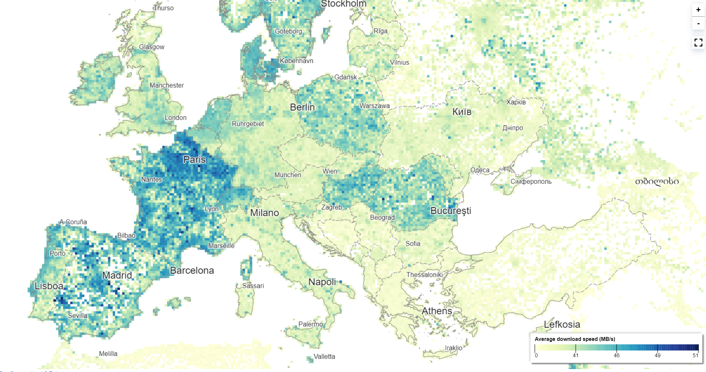

# gridviz-ookla

Visualize Ookla internet speed open data using gridviz

Using [GridTiler](https://github.com/eurostat/gridtiler) we will convert [ookla open datasets](https://github.com/teamookla/ookla-open-data) into a tiled CSV format ready to be visualized using [gridviz](https://github.com/eurostat/gridviz).


</img>

[Live demo](https://joewdavies.github.io/gridviz-ookla/viewer/)

## Step 1: SHP to CSV

First we must convert the ookla shapefiles to CSV.

### Get shapefiles:

URL Format: `https://ookla-open-data.s3.amazonaws.com/shapefiles/type=TYPE/year=YYYY/quarter=Q/FILENAME`

You can get them from here for example:

- [Mobile](https://ookla-open-data.s3.amazonaws.com/shapefiles/performance/type=mobile/year=2023/quarter=3/2023-07-01_performance_mobile_tiles.zip)
- [Fixed (broadband)](https://ookla-open-data.s3.amazonaws.com/shapefiles/performance/type=fixed/year=2023/quarter=3/2023-07-01_performance_fixed_tiles.zip)

### Convert to CSV using QGIS

- Add shapefile to map
- Clip layer to European extent
- Reproject to EPSG:3035 or whatever local projection you want if you are using a different section of the dataset.
- Calculate new fields for x and y cell coordinates using the `x_min( $geometry )` and `y_min( $geometry )` expressions.
- Export > save features as > CSV
- Export xmin ymin and data attributes (e.g. avg_d_kbps)
- Do not export geometry

#### Output format:

Should look something like this

| avg_d_kbps | avg_u_kbps | avg_lat_ms | tests | devices | x       | y       |
| ---------- | ---------- | ---------- | ----- | ------- | ------- | ------- |
| 74383      | 13659      | 95         | 1     | 1       | 3139382 | 6251612 |

## Step 2: Tile CSV using GridTiler

Install gridtiler:

With Node.js version >=14
Run `npm install gridtiler -g`

Once our data is in a grid.csv file, we can generate multi-resolution gridded CSVs with the following commands:

```
    gridtiler -i grid.csv -r 350 -a 1 -o 350m/ --preFunction "c.nb=1" --postFunction "c.avg_d_kbps = c.avg_d_kbps/c.nb; delete c.nb"
    gridtiler -i grid.csv -r 350 -a 2 -o 700m/ --preFunction "c.nb=1" --postFunction "c.avg_d_kbps = c.avg_d_kbps/c.nb; delete c.nb"
    gridtiler -i grid.csv -r 350 -a 5 -o 1750m/ --preFunction "c.nb=1" --postFunction "c.avg_d_kbps = c.avg_d_kbps/c.nb; delete c.nb"
    gridtiler -i grid.csv -r 350 -a 10 -o 3500m/ --preFunction "c.nb=1" --postFunction "c.avg_d_kbps = c.avg_d_kbps/c.nb; delete c.nb"
    gridtiler -i grid.csv -r 350 -a 20 -o 7000m/ --preFunction "c.nb=1" --postFunction "c.avg_d_kbps = c.avg_d_kbps/c.nb; delete c.nb"
    gridtiler -i grid.csv -r 350 -a 50 -o 17500m/ --preFunction "c.nb=1" --postFunction "c.avg_d_kbps = c.avg_d_kbps/c.nb; delete c.nb"
    gridtiler -i grid.csv -r 350 -a 100 -o 35000m/ --preFunction "c.nb=1" --postFunction "c.avg_d_kbps = c.avg_d_kbps/c.nb; delete c.nb"
```

- **-r** is our cell size (resolution)
- **-a** is the aggregation factor. Meaning that a value of -a 10 will generate cells 10 times the size of our original cell.
- **-o** is our output folder
- **--preFunction** is used to add a column (nb) for counting how many cells are in each aggregation cell. This is then used for calculating the averages in our --postFunction.
- **--postFunction** is used to alter the cell contents after aggregation. As we are using averages we must calculate the average of the cells in the aggregated cell.

## Step 3: Visualize with gridviz

Once we have our tiled grid, we can visualize it using [gridviz](https://github.com/eurostat/gridviz) like so:

You can find the full code to [this working example](https://joewdavies.github.io/gridviz-ookla/viewer/) here: [https://github.com/joewdavies/gridviz-ookla/blob/main/viewer/index.html](https://github.com/joewdavies/gridviz-ookla/blob/main/viewer/index.html)

```javascript
.addMultiScaleTiledGridLayer(
    // Array of resolutions, in CRS unit (m):
    [350, 700, 1750, 3500, 7000, 17500, 35000],
    // Function which returns the URL to the CSVs for each resolution:
    (r) => "../csv/europe/" + r + "m/",
    // The styles:
    [
        new gviz.SquareColorWGLStyle({
            colorCol: "MB/S",
            color: d3.interpolateYlGnBu,
        }),
    ],
    // Options:
    {
        //The maximum pixel size before jumping to a lower resolution:
        pixNb: 5,
        //for each cell, before drawing:
        preprocess: (c, r) => {
            if (c.devices < 3) return false; // omit cells that have less than 3 devices tested
            if (!c.avg_d_kbps) c.avg_d_kbps = 0;
            c["MB/S"] = Math.floor(c.avg_d_kbps / 1000 / 8); // Create new field for MB/s. There are 8 megabits in a megabyte.
        },
        // Tootlip HTML:
        cellInfoHTML: (cell) => {
            let html = "";
            html += `Average download speed: <strong>${cell["MB/S"]} MB/S</strong>`;
            html += `<br>Tests: ${cell.tests}`;
            html += `<br>Devices: ${cell.devices}`;
            return html;
        },
    }
);
```

For reference ([source](https://github.com/teamookla/ookla-open-data)):

- **kbps** or Kilobits Per Second - One kilobit is 1000 bits, and bits are the smallest possible unit of information (a little on/off switch). This was typically used by mobile connections, but as mobile carriers get faster they're switching over to megabits.
- **kB/s** or KiloBytes Per Second - Bytes are made up of eight bits, so one kilobyte equals eight kilobits. File-sizes on your computer are typically measured in bytes, so you'll usually see kilobytes used by download utilities. Bytes are capitalized when used in acronyms to distinguish them from bits, since both start with the letter B.
- **Mbps** or Megabits Per Second - The default, as we've already discussed. It takes 1000 kilobits to make a megabit.
- **MB/s** or MegaBytes Per Second - It takes eight megabits to make one megabyte. Most of the files on your computer are measured in megabytes, and if you have a fast connection you'll see this used in download utilities.

## License

[Creative Commons Attribution-NonCommercial-ShareAlike 4.0 International (CC BY-NC-SA 4.0)](https://creativecommons.org/licenses/by-nc-sa/4.0/)
